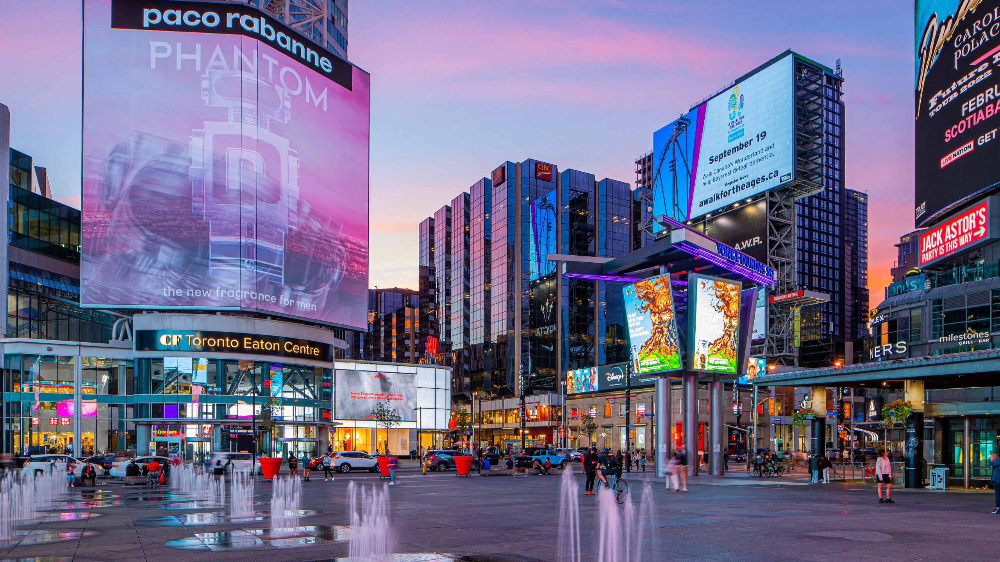
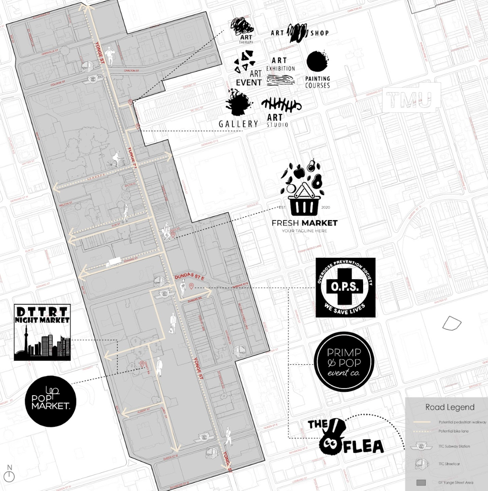

# Downtown Yonge

>Group Members:  
>> Yunni Qu (me), Department of Computer Science   
>> Wana Saiful, Department of Geography & Planning  
>> Reese Halfyard, Faculty of Information  
>> Xingtian Gong (Kiana), John H. Daniels Faculty of Architecture, Landscape and Design  

### About
Downtown Yonge is an iconic street in Toronto that has played a central role in the city's cultural landscape, transportation network, and economic development. However, the COVID-19 pandemic has severely impacted its urban life and local community endurance, revealing existing infrastructural and societal issues that require immediate attention. This project aims to reimagine Downtown Yonge by proposing solutions to enhance its livability and sustainability in the wake of the pandemic.

### Problem Statement
The COVID-19 pandemic has severely impacted Downtown Yonge as a main street in Toronto, with the existing civic infrastructure not reflecting the transformative demands of the changing street. This has resulted in a lack of social, physical, cultural, and economic resilience, highlighting the need for intervention to support the vitality of the street in the long term. Therefore, our project aims to closely study how Downtown Yonge has been impacted by the pandemic, evaluate the existing state of civic infrastructure, and identify interventions that can build resilience and support the recovery of the main street post-pandemic while promoting equity and vitality.

### Methods
To develop our design interventions for Downtown Yonge, we used a mixed-methods research approach that included both preliminary and primary research to understand the needs and challenges of the area. This involved interviewing key stakeholders and conducting corridor and intersection observations to investigate traffic, street characteristics, business types, and storefront vacancies. We also conducted secondary research that analyzed previous pedestrianization case studies, investment policies, and mobility data. Based on these findings, we designed initial interventions that were evaluated through feedback from stakeholders and further analysis of similar case studies. We refined our interventions based on these insights to better address the needs and challenges of Downtown Yonge.

### Design Interventions
Our theory of change is to redirect the focus of development from main streets to secondary streets along Yonge street, creating more gathering spaces for pedestrians, cyclists, and local businesses. These spaces are crucial to the community's well-being and mental health, especially post-pandemic, as they facilitate engagement and interaction. Through a combination of physical, programmatic, and municipal changes, the theory aims to promote social vitality, safety, and equitable neighborhoods, enabling more effective and long-lasting placemaking activities in the community.

> Municipal Investments:  
>>The Safe Inclusive Strategy developed by the Downtown Yonge BIA provides various strategies to address homelessness, violence, and substance abuse. However, to address the root issue of poverty and high living costs, it is recommended to partner with municipal leaders to increase social housing and safe injection sites, which can provide permanent solutions to alleviate pain points for Toronto's homeless population.  

> Program-Based Interventions:  
>> Small-scale placemaking activities that are community-focused can help build capacity and address community issues in DT Yonge. One such approach could be to promote local artists to highlight the area's rich musical history, contributing to the community's cultural identity and sense of place. This could involve creating performance spaces, hosting music festivals, or supporting local musicians through public art installations or workshops, all of which can foster community engagement and create a vibrant, thriving neighborhood.  

> Phsical-Based Interventions:  
>> To improve connectivity, secondary streets can be pedestrianized, and living street designs can be implemented, including complete streets and woonerfs. This approach prioritizes pedestrians, cyclists, and public transit and creates social spaces that attract diverse user interactions.

### My Contributions -- Data Driven Approach for Designing Interventions
During the porject I worked on collecting original data and inspecting external data that contributed to identifying existing problems and designing of our  interventions. I analyzed business types in DT Yonge, accidents involving pedestrians, and the relationship between store vacancies and crime cases. My contribution was essential in identifying the impact of store vacancies on the area's safety and overall business environment, providing valuable insights into potential interventions to address this issue. 

| Sub-region   | store vacancy     | crime cases |
|:-------------|:------------------|:------|
| College-Bay           | 2 | 7  |
| College-Yonge | 1   | 17  |
|Gerrard-Bay  | 4  | 5  |
| Gerrard-Yonge  | 6 | 20  |
| Dundas-Bay| 1     | 9   |
| Dundas-Yonge| 11 | 48  |
| Queen-Bay| 1 | 4  |
| Queen-Yonge | 1 | 4  |

> I divided our region into 8 sub-regions to inspect the connection between store vacancy and crime cases. In the context of the data, pedestrianization could potentially be a solution to address some of the issues present in the sub-regions with high crime rates and/or high store vacancies. This has led to
designing of physical interventions that pedestrianize the streets. Pedestrianization can encourage more people to visit the area, which can in turn support local businesses and potentially reduce the number of store vacancies. 

